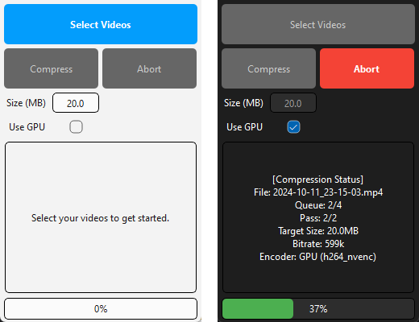

# DRAGGY ENCODER v1

A professional video compressor with full hardware acceleration support.



## Features

- 🎯 **Target any file size** — Set your desired output size in MB
- 🖥️ **Hardware acceleration** — NVIDIA NVENC, Intel QSV, AMD AMF, Linux VAAPI
- 🔍 **Smart hardware probing** — Auto-detects what your GPU actually supports
- 📂 **Drag & Drop** — Drop video files directly onto the window
- 🎬 **Multiple formats** — MP4, MKV, AVI, MOV, WEBM, FLV, M4V
- 🔄 **Export conversion** — Change container format on the fly
- 📊 **Two-pass encoding** — Optimal quality at target size
- 🖱️ **Device selection** — Choose between CPU, iGPU (Intel/AMD), or Dedicated GPU
- 🎨 **10-bit support** — Separate 8-bit and 10-bit NVENC variants
- 🔔 **Desktop notifications** — Get notified when encoding finishes
- 💾 **Settings persistence** — Remembers your preferences
- 🐧 **Cross-platform** — Windows & Linux

## Download

Go to the [Releases](../../releases) page and download:

| Platform | File | How to install |
|----------|------|----------------|
| **Windows** | `DraggyEncoder_v1_Setup.exe` | Run the installer |
| **Linux** | `DraggyEncoder-v1-x86_64.AppImage` | `chmod +x` and run |

> **Note**: FFmpeg is downloaded automatically on first launch.

## Build from Source

### Requirements
- Python 3.12+
- pip

### Steps

```bash
git clone https://github.com/thedevil4k/draggy-encoder.git
cd draggy-encoder
pip install -r requirements.txt
python main.py
```

### Build Installer (Windows)

```bash
pip install pyinstaller
pyinstaller draggy_encoder.spec
# Then use Inno Setup to compile installer.iss
```

### Build AppImage (Linux)

```bash
pip install pyinstaller
pyinstaller draggy_encoder.spec
# Then use appimagetool to create the AppImage (see .github/workflows/build.yml)
```

## Tech Stack

- **Python 3.12** + **PySide6** (Qt)
- **FFmpeg** for video encoding
- **PyInstaller** for packaging
- **Inno Setup** (Windows installer)
- **AppImage** (Linux portable)

---

Made with ❤️
