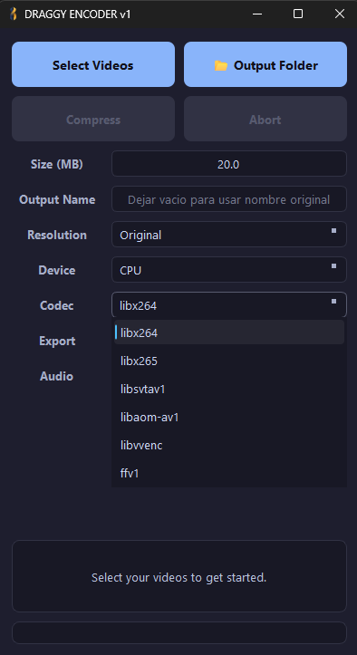

# 🚀 THE-DRAGGY-ENCODER v1.0.0

[](LICENSE)
[](https://www.python.org/downloads/)
[](https://doc.qt.io/qtforpython-6/)

**The-Draggy-Encoder** is a powerful, sleek, and high-performance video compressor designed for enthusiasts who want maximum quality with minimum effort. It handles hardware acceleration across all major platforms and features a modern tray-integrated interface.



## ✨ Key Features

- 🎯 **Target-Size Encoding** — Set your desired output size in MB and let the 2-pass engine do the magic.
- ⚡ **Full Hardware Acceleration** — Native support for:
  - **NVIDIA** (NVENC H.264, HEVC, AV1)
  - **Intel** (QSV H.264, HEVC, AV1)
  - **AMD** (AMF H.264, HEVC, AV1)
  - **Linux VAAPI** (Cross-vendor)
- 🧬 **H.266 (VVC) Ready** — Support for the next-gen Versatile Video Coding via CPU (`libvvenc`).
- 📥 **Drag & Drop** — Select hundreds of files at once by simply dropping them onto the window.
- 📐 **Resolution Scaling** — Smart resolution downscaling (4K, 1440p, 1080p, 720p, etc.) while preserving aspect ratios.
- 🎧 **Audio-Only Mode** — Automatically switches to audio compression (MP3, FLAC, AAC) when audio files are dropped.
- 📥 **System Tray (Background Mode)** — Minimize to the tray to keep your workspace clean while encoding runs in the background.
- 🔔 **Desktop Notifications** — Instant alerts when your queue finishes.
- 📦 **Dynamic Exporting** — Change container formats (MP4, MKV, AVI, MOV, WEBM) with codec compatibility checks.
- 💾 **Smart Settings** — Persistent configuration that remembers your favorite devices and encoders.

## 🛠️ Prerequisites

- **FFmpeg**: Handled automatically. The app downloads the appropriate binaries on first run if they are missing.
- **Drivers**: For hardware acceleration, ensure your GPU drivers (NVIDIA, Intel, or AMD) are up-to-date.

## 📥 Get Started

Go to the [Releases](../../releases) page to download the latest version for your OS:

| OS | Format | Installation |
|---|---|---|
| **Windows** | `.exe` | Standard Installer (created with Inno Setup) |
| **Linux** | `.AppImage` | Portable AppImage (chmod +x and run) |

## 💻 Build from Source

### Dependencies
- Python 3.12+
- FFmpeg (If not using the auto-downloader)

### Setup
```bash
# Clone the repository
git clone https://github.com/thedevil4k/THE-DRAGGY-ENCODER.git
cd THE-DRAGGY-ENCODER

# Setup environment
python -m venv .venv
# Windows: .venv\Scripts\activate | Linux: source .venv/bin/activate

# Install dependencies
pip install -r requirements.txt

# Run the app
python main.py
```

### Packaging

Use the following scripts to generate installers and packages for your OS:

**Windows (.exe)**
- Run `powershell .\scripts\build_win.ps1`
- Output: `../DRAGGY_RELEASES/`

**Linux (.deb, .rpm, .AppImage)**
- Run `bash .\scripts\build_linux.sh`
- Output: `../DRAGGY_RELEASES/`

## 🏗️ Technology Stack

- **GUI**: PySide6 (Qt)
- **Engine**: FFmpeg + FFprobe
- **OS Integration**: ctypes (Windows AppUserModelID), QSystemTrayIcon
- **Logging**: Loguru & Custom UI Log
- **Packaging**: PyInstaller & Inno Setup

## 🤝 Contributing

Contributions are welcome! Please check [CONTRIBUTING.md](CONTRIBUTING.md) for guidelines.

## 📄 License

Distributed under the **MIT License**. See `LICENSE` for more information.

---

*Made with ❤️ by [thedevil4k](https://github.com/thedevil4k)*
